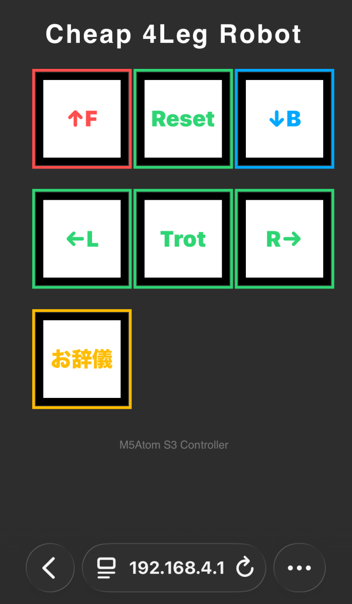

# cheap-4leg
チープ４足ロボットのプログラム
Arduino IDE用

## プログラム
* cheap1 --- シンプルなプログラム．WiFi不使用
* CheapBrowser --- WiFi経由でブラウザでコントロールできる．シリアルインターフェースもある
* CheapBrowserGLM --- 上記に数学ライブラリGLMを使って軌道計算をしやすくしたもの．glmのインストールが必要

## Arduino IDE による開発環境設定
* ArduinoIDE 1.8.19のzipバージョンをダウンロードし，展開する．
* ポータブル化するためにportableフォルダを作って起動する．
* ボードマネージャから以下インストール
    - ESP32 by Espressif Systems
* ボード　M5atom S3 を選ぶ
* ライブラリマネージャから以下インストール
    - Adafruit PWM Servo Driver Library
    - Adafruit BUS IO
    - M5Unified
* GLMのヘッダファイル群をportable/sketchbook/libraries/フォルダの中に入れる．
```
portable
   +packages
   +sketchbook
        +libraries
             +glm,...
                  +glm.hpp,...
```
のようになっていればよい


## ブラウザでの使い方
* SSIDに接続　"M5Atom_Robot_test"など．
* パスワード入力
* 192.168.4.1をブラウザで開くと以下の操縦画面が開く．



## シリアルインターフェースでの使い方
* シリアルモニタ等で115200bpsで接続
* w+回数で間歇クロールを回数周期だけ実行
* （cheap1の場合　wキー+Enter1回で間歇クロール待機状態， ここで何かキーを押すと歩行開始）
* b+回数で間歇クロール後退
* 1 + Enter で PWMテスト
* 2 + Enter  で サーボ角テスト
* 3 + Enter  で Leg角オフセットを付けてテスト
* 4 + Enter  で 脚座標系で逆運動学テスト
* 5 + Enter  で 胴体座標系で逆運動学テスト
